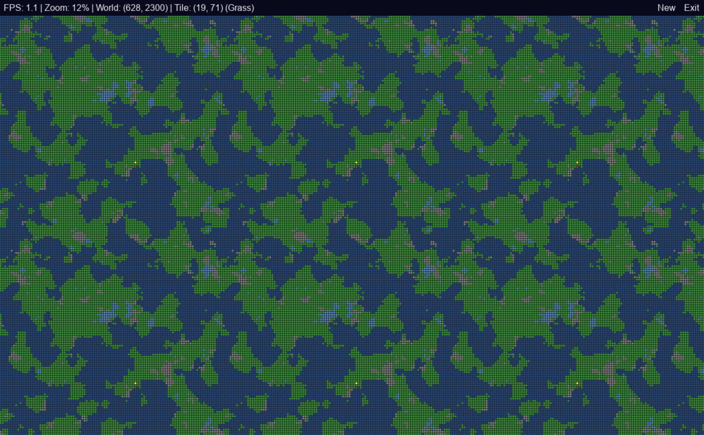

# WorldDom  🚀 👽 (ination) 🔫

[](https://github.com/TonyKennah/worldom/actions/workflows/pylint.yml)

[](https://github.com/TonyKennah/worldom/actions/workflows/python-package-conda.yml)

A 2D strategy game prototype created with Python and Pygame, featuring procedural world generation and tile-based unit movement.

## Project Purpose
The project is a 2D strategy game named "World Dom" built with Python and Pygame. It features procedural world generation using Perlin noise, a dynamic camera with zoom and pan, a tile-based map, A* pathfinding for unit movement, and basic unit selection and control.  There are multiple world types from Earth like environments to frozen wastelands, hot lava worlds and hostile surroundings.

## Features

*   **Procedural World Generation:** Creates unique, seamlessly tileable worlds using 4D Perlin noise. This ensures that the wrap-around map has no visible seams, creating a truly continuous world.
*   **Dynamic Camera:** A fully featured camera with stepped zooming (centered on the cursor) and smooth panning (using WASD keys and edge scrolling).
*   **Interactive Tile Map:** An efficient, tile-based map that only renders visible tiles and displays a grid at appropriate zoom levels.
*   **A\* Pathfinding:** Intelligent, natural-looking unit movement that navigates around obstacles. The pathfinding has been tuned to feel less "robotic" by introducing a small random cost to each step.
*   **UI Panel:** An on-screen UI panel displays key information like FPS, zoom level, and cursor coordinates, and includes a clickable Exit link.
*   **Unit Control:** Select single units with a left-click or multiple units by dragging a selection box. Command selected units via a right-click context menu. The "Build" command opens a sub-menu with structure options.

## Tech Stack

*   **Language:** Python 3
*   **Core Library:** [Pygame](https://www.pygame.org/news)
*   **Map Generation:** `noise` library for Perlin noise

## Code Style
The project follows standard Python conventions (PEP 8). It uses type hints for function signatures and class attributes. Docstrings are used to explain the purpose of modules, classes, and functions. The code is organized into classes and methods, with a clear separation of concerns between different components (e.g., `Game`, `Camera`, `Map`, `Unit`). The project uses a `src` layout to separate source code from other files.

## Getting Started

### Prerequisites

Make sure you have Python 3 installed on your system.

### Installation & Running

1.  **Set up the project:**
    If you have cloned this via git, you can skip this step. Otherwise, ensure all files are in the `worldom` directory as structured below.

2.  **Install the required libraries:**
    Navigate to the project's root directory in your terminal and run:
    ```bash
    pip install -r requirements.txt
    ```

3.  **Run the game:**
    The main entry point is `main.py`. Run it from the root directory:
    ```bash
    python main.py
    ```

## Suggested Commands
- **Run the game:** `python main.py`
- **Install dependencies:** `pip install -r requirements.txt`
- **Run all tests:** `python -m unittest discover -v tests`
- **Run a specific test file:** `python -m unittest -v tests/test_unit.py`
- **Linting:** `pylint --extension-pkg-allow-list=pygame $(git ls-files '*.py')` (Note: This command is from the GitHub Actions workflow and might need to be adapted for local use, especially on Windows, e.g., by replacing `$(git ls-files '*.py')` with a list of Python files).

## Task Completion
After completing a task, you should run the linter to ensure the code quality is maintained. There are no automated tests set up for this project.

## Project Structure

The project uses a standard `src` layout to keep the source code organized and separated from other assets.

```
worldom/
├── src/
│   ├── camera.py
│   ├── context_menu.py
│   ├── debug_panel.py
│   ├── game.py
│   ├── globe_frames.py
│   ├── globe_renderer.py
│   ├── input_handler.py
│   ├── map.py
│   ├── selection_manager.py
│   ├── settings.py
│   ├── ui_manager.py
│   ├── unit.py
│   └── world_state.py
└── main.py
└── requirements.txt
```


### Source Code Breakdown

*   **`main.py`**: The main entry point of the application. It initializes the `Game` object and runs the main game loop.

*   **`src/settings.py`**: Contains global constants and configuration settings for the game, such as screen dimensions, colors, tile sizes, and game speed. This file does not contain any classes.

*   **`src/game.py`**: The core game class (`Game`) that manages the main game loop, event handling, and game state.

*   **`src/camera.py`**: Implements the game camera for panning and zooming.
    *   **`ZoomState` class**: Encapsulates the state and logic for camera zooming.
    *   **`Camera` class**: Manages the camera's viewable area, position, and zoom/pan states.

*   **`src/context_menu.py`**:
    *   **`SubMenuState` class**: Encapsulates the state of a context sub-menu.
    *   **`ContextMenuState` class**: Encapsulates all state related to the right-click context menu.

*   **`src/debug_panel.py`**:
    *   **`DebugPanel` class**: Handles rendering and interaction for the top debug panel.

*   **`src/globe_frames.py`**:
    *   **`create_globe_animation_frames()`**: Function to create frames for a rotating globe animation.

*   **`src/globe_renderer.py`**:
    *   **`render_map_as_globe()`**: Function to render the map as a 3D globe.

*   **`src/input_handler.py`**:
    *   **`InputHandler` class**: Manages all user input, including keyboard and mouse events.

*   **`src/map.py`**: Handles the procedural generation, pathfinding logic, and rendering of the game world.
    *   **`VisibleArea` class**: A dataclass to represent the visible area of the map.
    *   **`AStarState` class**: A helper class to hold the state of an A* pathfinding search.
    *   **`Map` class**: Manages the game map, including generation and pathfinding.

*   **`src/selection_manager.py`**:
    *   **`SelectionManager` class**: Manages the selection of units.

*   **`src/ui_manager.py`**:
    *   **`UIManager` class**: Manages the user interface, including the debug panel and context menus.

*   **`src/unit.py`**: Defines the behavior and appearance of controllable units in the game.
    *   **`Unit` class**: Represents a single unit in the game.

*   **`src/world_state.py`**:
    *   **`WorldState` class**: A data class to hold the current state of all game entities.

### Example Map 
Fully zoomed out for debug purposes



[](https://www.youtube.com/watch?v=7C-pfmnbEbI)
